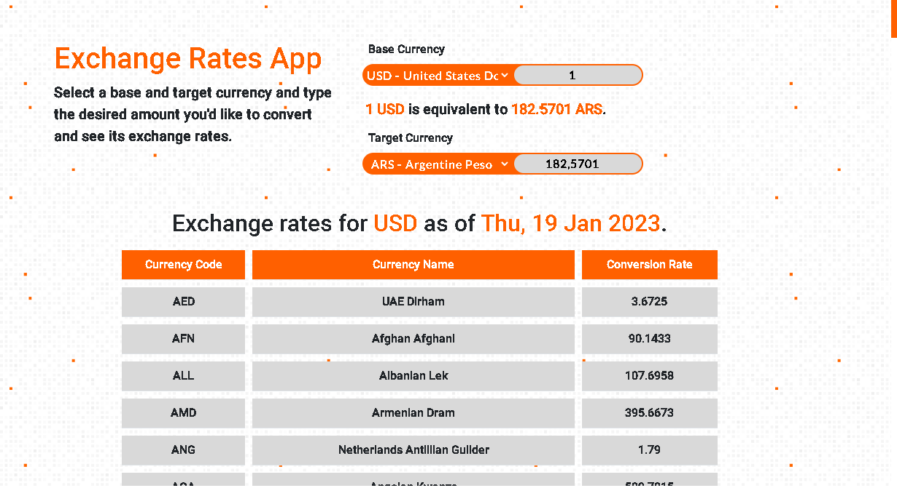

[](https://github.com/Horacaz/exchange-rates-app/actions/workflows/pipeline.yml)

# Exchange-rates-app

A simple Exchange Rates App using `exchange-rates-api.com`. It lets you see the equivalencies
of different currencies displayed on a table. Also enables the user to select both a Base Currency and a Target Currency. By introducing a desired amount the app will show the equivalence between these and update the exchange calculator on the fly.

## Getting started with this repository

After downloading this repository or cloning this repository `git clone https://github.com/Horacaz/exchange-rates-app` it is necessary to install its dependencies by running `npm install`.

## Development Build

After installing the dependencies it is neccesary to run the following script `npm run build`. This will create a distributable build of the project compiled to Javascript from Typescript. After the build is created you may run `npm run start` to initialize a development server, this will let you see a preview of the App working as intended.

With the development server running you may run `npm run dev` to start the Typescript compiler watcher and start editing the code. After the changes are made you will have to re-build the distribution to see the changes in the runnning development server.

### Preview of the scripts.
```
{ 
 "test": "jest src",
 "cypress": "cypress run",
 "lint": "eslint src/** cypress/e2e",
 "start": "http-server -c-1 dist",
 "dev": "tsc -w",
 "build": "tsc",
 "postbuild": "copyfiles styles/* assets/* index.html dist/"
},
  ```

## Tech Stack

This App has been made using Typescript and styled with Bootstrap 5. It is also Unit Tested with Jest and E2E Tested with Cypress, the code is also linted using Eslint. The repository possess a GitHubActions workflow to ensure any pull request and pushes to the main branch are updated and the changes made pass both the Unit Tests and E2E Tests. 
## App Preview


